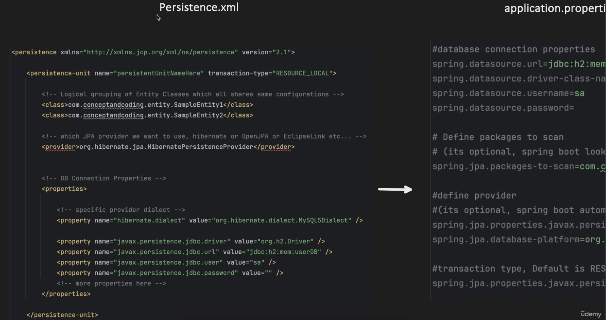
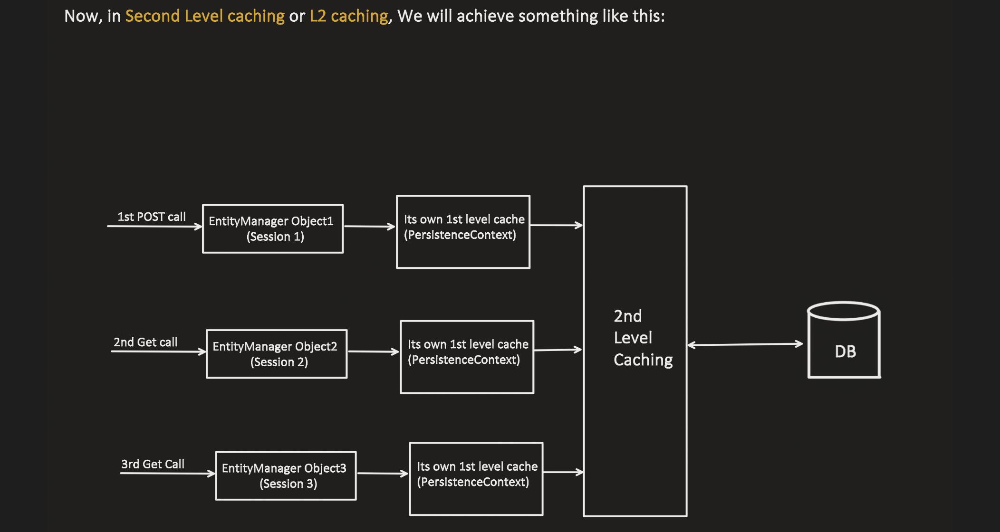
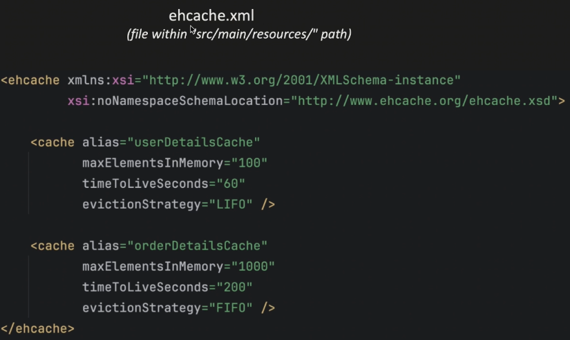
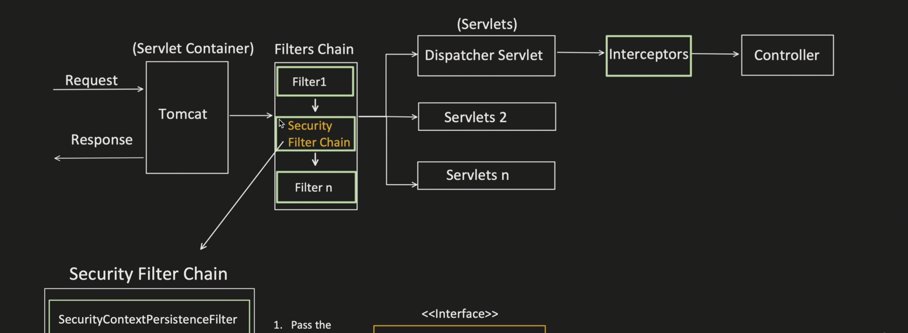
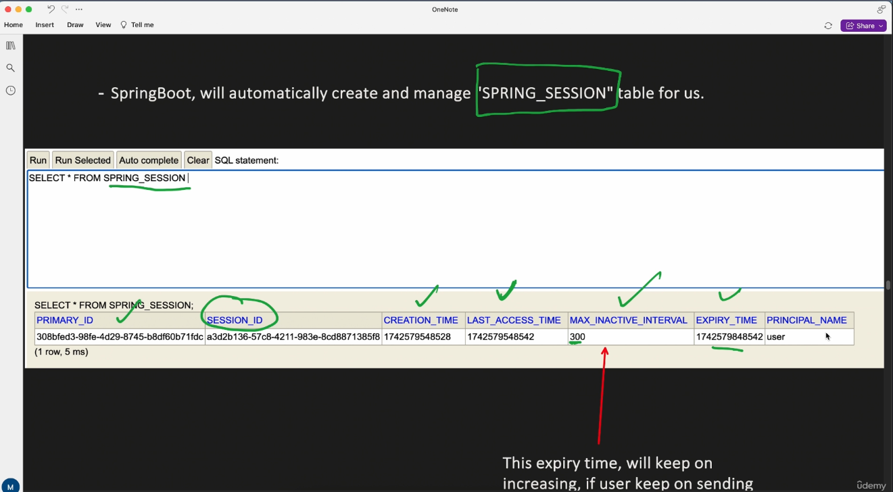

## Spring-boot udemy course notes

1. Spring boot is known for dependency injection. When we start a spring-boot project, beans are created in Application Context and stored for injections into classes later.

2. When we have a @Lazy on a field in a class as below
```java
@Component
public class OnlineOrder implements Order {
    @Lazy
    @Autowired
    Product product;
    // other fields
}
```
spring creates OnlineOrder object by adding a proxy product object(child of product) for the time being. When we want to use product then spring injects the actual bean. If the product class is marked as final, spring would not be able to create a proxy object and inject, eventually the application will fail to start.

3. AOP : Aspect Oriented Programming, is known for offloading the cross-cutting concerns such as logging, updating metrics etc. so that we can focus on writing main business logic.

4. AOP key terms -> Aspect(it is the file containing advice and pointcut), Advice(it is a method that perform some cross-cutting task, e.g. logging when we call a repository method), Pointcut(it tells where all this advice is applicable, suppose a advice needs to be run on all the methods of a particular class, that can be mentioned in the pointcut).

5. Pointcut -> tells where advice should be applied. Types of point cuts :
   - execution(for methods matching the pointcut expression) e.g., @Before("execution(public String com.bsharan.demo_project.component.User.init())"), wildcards can be used (*(exact 1 match) ..(0 or more match))
   - within(matches all method within a class/package) e.g., @Before("within(com.bsharan.demo_project.component.User)") OR @Before("within(com.bsharan.demo_project.component..*)")
   - @within(any class have a particular annotation) e.g., @Before("@within(org.springframework.stereotype.Component)")
   - @annotation(matches any method that is annotated with given annotation) e.g., ("@annotation(org.springframework.web.bind.annotation.GetMapping)") - matches all method annotated with @GetMapping.
   - args(matches any method with particular argument) e.g., @Before("args(String, int)") OR @Before("args(com.bsharan.demo_project.component.User, Long)")
   - @args(matches any method with particular parameters and that parameter class is annotated with particular annotation)

6. We can also combine multiple point cuts using &&, ||

7. Named point cuts e.g., @Pointcut("execution(...)") public void customPointcutName(){ //empty method }. Now it can be used as @Before("customPointcutName").

8. When a pointcut is matched, we need to define when will the advice be executed, before running the method for which PC has been matched, after or around using these annotations - @Before, @After, @Around(it surrounds the method start and end).

9. In case of @Around, we have to call the method explicitly, it can be done using joinPoint.proceed(). So the flow is -> PC expression matched for @Around, then advice starts executing until it reaches joinPoint.proceed()

10. How AOP works : Assume we have this service:
```java
@Service
public class PaymentService {
    public void processPayment() {
        System.out.println("Processing payment");
    }
}
```
And an aspect:
```java
@Aspect
@Component
public class LoggingAspect {

    @Before("execution(* com.example.service.PaymentService.processPayment(..))")
    public void logBefore() {
        System.out.println("Logging before payment");
    }
}
```
AOP flow :
   - When the Spring application starts, it scans the classpath and identifies all classes annotated with @Aspect (for example, LoggingAspect). 
   - Spring parses the pointcut expression execution(* com.example.service.PaymentService.processPayment(..)) and stores it in an efficient structure for quick lookup (PointcutParser.class).
   - During bean creation, Spring creates beans for classes annotated with @Component, @Service, etc. for example, it creates a bean for PaymentService.
   - Before returning the PaymentService bean to the container, Spring checks whether any stored pointcut matches methods of this bean. Since the pointcut targets PaymentService.processPayment(), the bean is eligible for AOP. 
   - Instead of returning the original PaymentService object, Spring creates a proxy around it. This proxy contains logic to run the advice (logBefore) when processPayment() is called. Internally this is handled by classes such as AbstractAutoProxyCreator, DefaultAopProxyFactory, and ReflectiveMethodInvocation.

So when the application calls paymentService.processPayment() the actual call flow becomes:
```text
            Client
               ↓
            Proxy (created by Spring AOP)
               ↓
            execute @Before advice (logBefore)
               ↓
            actual method PaymentService.processPayment()
```
The specific bean being proxied here is the PaymentService bean, because its method matches the pointcut defined in LoggingAspect.

11. @Transaction - used when we want an operation to execute under a transaction(AOP behind the scene). If applied at class level it automatically applied to all public methods and it can also be applied at a method level. Can we use this annotation on a class marked as final or a method marked as final? -> No, because CGLIB won't be able to create it's proxy. Assume we have a class like below
```java
@Service
public class MyService {

    @Transactional
    public void m1() {
        m2();
    }

    @Transactional
    public void m2() {
        // some DB work
    }
}
```
so for this CGLIB will create a proxy object for e.g., MyService$$CGLib001 and conceptually it looks like below
```java
public class MyService$$CGLib001 extends MyService {

    private TransactionInterceptor transactionInterceptor;

    @Override
    public void m1() {
        transactionInterceptor.invoke(
            () -> super.m1()
        );
    }

    @Override
    public void m2() {
        transactionInterceptor.invoke(
            () -> super.m2()
        );
    }
}
```
So when we call myService.m1(), the actual object on which the call happens is MyService$$CGLib001 and the flow is
```text
            Proxy.m1()
               ↓
            TransactionInterceptor.start()
               ↓
            super.m1()   ← executes target logic
```
Now inside super.m1() if we call m2, the call becomes this.m2, here this is the actual object not the proxy, hence the function do not enter the interceptor chain again and CGLIB doesn't intercept internal calls as Spring’s interceptor mechanism only wraps calls that enter from outside via proxy dispatch. Hence, the @Transaction on m2 is ignored and no new transaction will be crated, still m2 runs in the same transaction started by m1.

12. When we want ACID, we have to start DB operations in a transaction. BEGIN TRANSACTION, if all success then COMMIT else ROLLBACK. Now all of this transaction related code we don't need to write, it is taken care under an AOP(TransactionAspectSupport.class). There is a joinPoint which actually invokes methods.

13. Transaction in spring boot : Below is the hierarchy for transaction managers in spring-boot. * marked are for local transactions(happening in a single machine)
```text
        <<TransactionManager>>
                    ↓
        <<PlatformTransactionManager>> (getTransaction(), commit(), rollback())
                    ↓
        AbstractPlatformTransactionManager (default implementation for above methods)
                    ↓
        +---------------------------------------------+
        ↓               ↓               ↓             ↓
*DataSourceTM      *Hibernate-TM     *JPA-TM     JTA-TM (distributed, 2PC)
        ↓                                                               
    JDBC-TM(local JDBC)
```
14. Transaction Management : Declarative approach(@Transactional), Programmatic approach

15. Declarative approach : Based on underlying datasource, spring-boot chooses a transaction manager itself. If we want to give our configs, it can be done as below
```java
import jakarta.transaction.Transactional;
import org.springframework.context.annotation.Bean;
import org.springframework.context.annotation.Configuration;
import org.springframework.jdbc.datasource.DataSourceTransactionManager;
import org.springframework.jdbc.datasource.DriverManagerDataSource;
import org.springframework.stereotype.Component;
import org.springframework.transaction.PlatformTransactionManager;

import javax.sql.DataSource;

@Configuration
public class AppConfig {
    @Bean
    public DataSource dataSource() {
        DriverManagerDataSource dataSource = new DriverManagerDataSource();
        dataSource.setDriverClassName("org.h2.Driver");
        dataSource.setUrl("jdbc:h2:mem:testdb");
        dataSource.setUsername("root");
        dataSource.setPassword("password");
        return dataSource;
    }
    // if we don't provide any name, the method name is the bean name here bean name is -> "userTransactionManager"
    @Bean
    public PlatformTransactionManager userTransactionManager(DataSource dataSource) {
        return new DataSourceTransactionManager(dataSource);
    }
}

// we can use this as below
@Component
public class UserDeclarative {
    @Transactional(transactionManager = "userTransactionManager")
    public void updateUserProgrammatic(){
        // some DB operations
    }
}
```
16. Programmatic approach -> transaction management using code. Why do we need it in first place?
```java
import jakarta.transaction.Transactional;
import org.springframework.stereotype.Component;

@Component
public class User {
    @Transactional
    public void fetchAadharCardForVerification(){
        // 1. update DB
        // 2. call external API
        // 3. update DB
    }
}
```
Issue in this code, if the external API is taking a lot of time, the db connection pool etc. would be locked until then under a transaction, this is a case of resource contention, solution -> programmatic transaction management in which we can control the flow i.e., where to begin, when to close connection, where to commit and rollback.

17. We can create a bean as below, still there are also another ways using TransactionTemplate
```java
import org.springframework.transaction.PlatformTransactionManager;
import org.springframework.transaction.TransactionDefinition;
import org.springframework.transaction.TransactionStatus;

@Component
public class UserProgrammatic {

    PlatformTransactionManager userTransactionManager;

    UserProgrammatic(PlatformTransactionManager userTransactionManager) {
        this.userTransactionManager = userTransactionManager;
    }

    public void fetchAadharCardForVerification() {
        DefaultTransactionDefinition defaultTransactionDefinition = new DefaultTransactionDefinition();
        TransactionStatus transactionStatus = userTransactionManager.getTransaction(defaultTransactionDefinition);
        try{
            // 1. update DB
            // 2. call external API
            // 3. update DB
            // only difference -> since we have userTransactionManager here, we can control where to commit and rollback and all.
            userTransactionManager.commit(transactionStatus);
        } catch(Exception e){
            userTransactionManager.rollback(transactionStatus);
        }
    }
}
```
17. Transaction Propagation -> used while creating transactions, useful if the transaction spans multiple services. Common types under declarative approach are :
    - REQUIRED :
      - if parent txn present, use it
      - else create new
    - REQUIRED_NEW :
      - if parent txn present
          - suspend it and create a new txn, once child txn is finished, resume the parent txn.
      - else create new txn
    - SUPPORTS :
      - if parent txn present, use it 
      - else execute without any transaction
    - NOT_SUPPORTED : 
      - if parent txn present, suspend it, execute method without txn, resume parent txn
      - else execute without any transaction
    - MANDATORY :
      - if parent txn is present use it
      - else throw exception
    - NEVER :
      - if parent txn is present, throw exception
      - else execute without txn

18. In Programmatic way, we can set the transaction propagation in the transaction definition and that can be passed along to other methods.
```java
import org.springframework.transaction.PlatformTransactionManager;
import org.springframework.transaction.TransactionDefinition;
import org.springframework.transaction.TransactionStatus;
import org.springframework.transaction.support.DefaultTransactionDefinition;

@Component
public class UserProgrammatic {

    PlatformTransactionManager userTransactionManager;

    UserProgrammatic(PlatformTransactionManager userTransactionManager) {
        this.userTransactionManager = userTransactionManager;
    }

    public void fetchAadharCardForVerification() {
        DefaultTransactionDefinition defaultTransactionDefinition = new DefaultTransactionDefinition();
        defaultTransactionDefinition.setName("Testing propagation methods");
        defaultTransactionDefinition.setPropagationBehavior(TransactionDefinition.PROPAGATION_REQUIRED);
        TransactionStatus transactionStatus = userTransactionManager.getTransaction(defaultTransactionDefinition);
        try {
            // 1. update DB
            // 2. call external API
            // 3. update DB
            // only difference -> since we have userTransactionManager here, we can control where to commit and rollback and all.
            userTransactionManager.commit(transactionStatus);
        } catch (Exception e) {
            userTransactionManager.rollback(transactionStatus);
        }
    }
}
```
19. Isolation levels - It tells how changes made by one transaction are visible to other transaction running in parallel. Depending on DB, the default isolation level changes.
```java
import jakarta.transaction.Transactional;
import org.springframework.transaction.annotation.Isolation;
import org.springframework.transaction.annotation.Propagation;

@Transactional(propagation = Propagation.REQUIRED, isolation = Isolation.READ_COMMITTED)
public void fetchAadharCardForVerification(){
    // DB operations
}
```
20. Springboot JPA Architecture :
```text
                         ┌────────────────────────┐
                         │    Application Logic   │
                         └─────────────┬──────────┘
                                       │
                         ┌─────────────▼──────────────┐
                         │ ORM Framework (JPA - API)  │
                         │ e.g., Hibernate/OpenJPA    │
                         └─────────────┬──────────────┘
                                       │
                         ┌─────────────▼──────────────┐
                         │     JDBC (API Interface)   │
                         └─────────────┬──────────────┘
                                       │
                         ┌─────────────▼─────────────────┐
                         │ Database Driver (Actual Impl) │
                         └─────────────┬─────────────────┘
                                       │
                         ┌─────────────▼──────────────┐
                         │     Relational Database    │
                         └────────────────────────────┘
```
21. Database Driver -> It is nothing but implementation of JDBC api(s). So assume we have a class as below defined in JDBC api.
```java
public Connection getConnection(){}
```
Now all the drivers Connector/J, PostgreSQL JDBC Driver, H2 Database Engine they implement these functions.

22. JDBC without spring-boot
```java
import org.hibernate.annotations.processing.SQL;

import java.sql.Connection;
import java.sql.DriverManager;
import java.sql.SQLException;

public class DatabaseConnection {
    public Connection getConnection() {
        try {
            // load driver in JVM
            Class.forName("org.h2.Driver");
            // establish connection with DB
            return DriverManager.getConnection("jdbc:h2:mem:userDB", "user", "password");
        } catch (ClassNotFoundException | SQLException e) {
            System.out.println(e.getMessage());
        }
    }
}

public class UserDAO {

    public void createUserTable() {
        try {
            Connection connection = new DatabaseConnection().getConnection();

            String sql = "CREATE TABLE IF NOT EXISTS users (" +
                    "id INT PRIMARY KEY AUTO_INCREMENT, " +
                    "user_name VARCHAR(100), " +
                    "age INT" +
                    ");";

            PreparedStatement preparedQuery = connection.prepareStatement(sql);
            preparedQuery.executeUpdate();

        } catch (SQLException e) {
            // handle exception
            e.printStackTrace();
        } finally {
            // close statement and DB connection
        }
    }

    public void createUser(String userName, int userAge) {
        try {
            Connection connection = new DatabaseConnection().getConnection();

            String insertQuery = "INSERT INTO users (user_name, age) VALUES (?, ?)";
            PreparedStatement preparedQuery = connection.prepareStatement(insertQuery);
            preparedQuery.setString(1, userName);
            preparedQuery.setInt(2, userAge);

            preparedQuery.executeUpdate();

        } catch (SQLException e) {
            // handle exception
            e.printStackTrace();
        } finally {
            // close preparedQuery and connection
        }
    }

    public void readUsers() {
        try {
            Connection connection = new DatabaseConnection().getConnection();

            String selectQuery = "SELECT * FROM users";
            PreparedStatement preparedQuery = connection.prepareStatement(selectQuery);

            ResultSet resultSet = preparedQuery.executeQuery();

            while (resultSet.next()) {
                int userId = resultSet.getInt("id");
                String name = resultSet.getString("user_name");
                int age = resultSet.getInt("age");

                System.out.println(userId + " " + name + " " + age);
            }

        } catch (SQLException e) {
            // handle exception
            e.printStackTrace();
        } finally {
            // close resultSet, preparedQuery and connection
        }
    }
}
```
Problem with this approach is a lot of boilerplate code is written again and again :
  - Driver class loading
  - Establish connection
  - Exception Handling
  - Closing of DB connection and other objects to prevent memory leaks
  - Manual handling of connection pool

23. JDBC with spring-boot -> Spring-boot provides JDBCTemplate class(Spring abstraction on top of JDBC using Template Design Pattern) which helps to remove all boilerplate code when we were using raw JDBC.
```text
            Your Code
               ↓
            JdbcTemplate        ← orchestrates JDBC usage
               ↓
            JDBC API            ← interfaces
               ↓
            JDBC Driver         ← implementation
               ↓
            Database
```
```java
import org.springframework.beans.factory.annotation.Autowired;
import org.springframework.stereotype.Component;
import org.springframework.stereotype.Repository;

public class User {
    long userId;
    String userName;
    int age;
    // constructors + getters + setters + others
}

@Repository
public class UserRepository {

    @Autowired
    JdbcTemplate jdbcTemplate;

    public void createTable() {
        String sql = "CREATE TABLE users (user_id INT AUTO_INCREMENT PRIMARY KEY, " +
                "user_name VARCHAR(100), age INT);";
        jdbcTemplate.execute(sql);
    }

    public void insertUser(String name, int age) {
        String insertQuery = "INSERT INTO users (user_name, age) VALUES (?, ?);";
        jdbcTemplate.update(insertQuery, name, age);
    }

    public List<User> getUsers() {
        String selectQuery = "SELECT * FROM users;";
        return jdbcTemplate.query(selectQuery, (rs, rowNum) -> {
            User user = new User();
            user.setUserId(rs.getInt("user_id"));
            user.setUserName(rs.getString("user_name"));
            user.setAge(rs.getInt("age"));
            return user;
        });
    }
}

@Component
public class UserService {

    @Autowired
    UserRepository userRepository;

    public void createTable() {
        userRepository.createTable();
    }

    public void insertUser(String userName, int age) {
        userRepository.insertUser(userName, age);
    }

    public List<User> getUsers() {
        List<User> users = userRepository.getUsers();
        for (User user : users) {
            System.out.println(
                    user.getUserId() + " : " +
                            user.getUserName() + " : " +
                            user.getAge()
            );
        }
        return users;
    }
}
```
All connection details can be present in application.properties
```application.properties
spring.datasource.url=jdbc:h2:file:./data/testdb
spring.datasource.driverClassName=org.h2.Driver
spring.datasource.username=sa
spring.datasource.password=
spring.h2.console.enabled=true
spring.h2.console.path=/h2-console
spring.jpa.hibernate.ddl-auto=update
```
JdbcTemplate takes care of all connection establishing, running insert and read query, closing DB connections etc. It throws granular level of exceptions for better debugging. Default HikariDataSource is used and it provides inbuilt HikariCP. If we want to use some different datasource, it can be used in a Config class.

24. JdbcTemplate still doesn't have automatic object mapping, caching, domain modeling, object graph management, relationship handling, hence to improve all these issues ORM framework was introduced. ORM allows us to work with objects. Acts as bridge between java objects and database tables.

```text
            Your Code
               ↓
            JPA(specification) / Hibernate(implementation)     ← ORM + mapping + unit of work
               ↓
            JDBC APIs
               ↓
            Database Driver
               ↓
            Actual Database
```
But, JDBC does not provide
  - Automatic entity mapping
  - Relationship handling (@OneToMany, @OneToOne)
  - Object graph loading
  - Lazy loading
  - Dirty checking - difference between entity when it was loaded and what happened to it during a transaction
  - Persistence context (1st-level cache)
  - Unit of Work
  - Cascades
  - Inheritance mapping
  - Second-level cache
  - JPQL / Criteria
  - Transparent transactions at object level

Hibernate provides
  - Automatic ResultSet → Object mapping
  - Entity state management (managed / detached)
  - Dirty checking (auto update generation)
  - Unit of Work (persistence context)
  - Identity map (no duplicate objects)
  - Relationship handling (@OneToMany, etc.)
  - Lazy loading & proxies
  - Cascading operations
  - JPQL / HQL / Criteria API
  - Database-vendor abstraction (Dialect)
  - First-level cache
  - Optional second-level cache
  - Inheritance mapping
  - Transaction integration
  - Batch processing support
```text
        Hibernate (for CRUD + domain logic)
        JdbcTemplate (for reports / batch / complex queries)
```

25. Hibernate was vendor specific and applications that used Hibernate directly became tightly coupled to it. Switching to a different ORM provider was difficult. To solve this problem, JPA (Java Persistence API) was introduced. JPA is a specification (interfaces + annotations) for ORMs. Hibernate is an implementation of this specification. Applications should depend on the JPA abstraction and let Hibernate act as the underlying provider. This keeps the codebase clean, portable, and maintainable. Below are some of the JPA imports which should be used:

```java
import jakarta.persistence.Entity;
import jakarta.persistence.Id;
import jakarta.persistence.GeneratedValue;
import jakarta.persistence.OneToMany;
```
To use JPA in a Spring Boot application, add the spring-boot-starter-data-jpa dependency. This starter pulls in JPA APIs (specification only), Spring Data JPA (provides JpaRepository, repository proxies, method-name query derivation, pagination, sorting, specifications, etc.), a JPA provider (Hibernate by default), and transaction and ORM infrastructure.
```text
            1997  → JDBC
            2001  → Hibernate ORM
            2003  → Spring JdbcTemplate
            2006  → JPA specification
```

Below is the internal architecture of JPA:


```text
            ┌────────────────────────────────────────────┐
            │               Your Code                    │
            │  @Service, @Controller, Business Logic     │
            └────────────────────────────────────────────┘
                                ↓
            ┌────────────────────────────────────────────┐
            │           Spring Data JPA                  │
            │  - Repository Proxies                      │
            │  - Method-name query derivation            │
            │  - Pagination / Sorting / Specs            │
            └────────────────────────────────────────────┘
                                ↓
            ┌────────────────────────────────────────────┐
            │               JPA API                      │
            │  - @Entity, @OneToMany                     │
            │  - EntityManager                           │
            │  - Persistence Context contract            │
            │  (Specification ONLY, no implementation)   │
            └────────────────────────────────────────────┘
                                ↓
            ┌────────────────────────────────────────────┐
            │         Hibernate (JPA Provider)           │
            │  - ORM engine                              │
            │  - Dirty checking                          │
            │  - SQL generation                          │
            │  - Dialect handling                        │
            │  - 1st / 2nd level cache                   │
            │  - Session / Unit of Work                  │
            └────────────────────────────────────────────┘
                                ↓
            ┌────────────────────────────────────────────┐
            │               JDBC API                     │
            │  - Connection                              │
            │  - PreparedStatement                       │
            │  - ResultSet                               │
            │  (Interfaces only)                         │
            └────────────────────────────────────────────┘
                                ↓
            ┌────────────────────────────────────────────┐
            │             JDBC Driver                    │
            │  - MySQL / Postgres / Oracle driver        │
            │  - Wire protocol                           │
            │  - Vendor-specific implementation          │
            └────────────────────────────────────────────┘
                                ↓
            ┌────────────────────────────────────────────┐
            │               Database                     │
            │  - Query parsing                           │
            │  - Execution plan                          │
            │  - Storage engine                          │
            └────────────────────────────────────────────┘
```
Spring Data JPA eliminates boilerplate DAO code. Without Spring Data JPA, developers would need to manually write repository implementations and wire EntityManager everywhere.

JPA APIs standardize ORM behavior across Java and decouple application code from a specific ORM vendor. JPA defines what an ORM should do, not how it should do it.

Hibernate implements the JPA specification and bridges object-oriented domain models with relational databases. JDBC works with rows and columns, while Hibernate allows developers to work with objects and relationships.

JDBC APIs provide a standard database access API in Java and avoid database-vendor-specific code. JDBC is the lowest common contract every Java database solution relies on.

JDBC drivers implement JDBC APIs for a given database and translate Java calls into database-specific wire protocol.

How JPA works internally: The Persistence Unit (PU) stores database configuration (driver, URL, username, password, dialect, etc.) along with entity mapping metadata. Hibernate (as the JPA provider) reads the persistence unit configuration during application startup. Using this configuration, an EntityManagerFactory (EMF) is created. Internally, this is Hibernate’s SessionFactory. Spring Boot autoconfigures and manages the lifecycle of the EMF, while Hibernate provides the actual implementation. The EntityManagerFactory produces EntityManager instances. Whenever the application needs to interact with the database for CRUD operations, it does so via an EntityManager. Each EntityManager is associated with a Persistence Context, which:
- holds managed entity instances
- provides first-level (L1) caching
- performs dirty checking and change tracking

Below is the complete flow, assuming we hit a findById(1) method:
```text
        findById(1)
            → Repository Proxy
                -> Runtime-generated implementation of the @Repository interface
                -> Holds a reference to the correct EntityManager
                -> Proxy is created once at application startup
            → EntityManager.find(User.class, 1)
            → Hibernate Session (Hibernate’s implementation of EntityManager)
                -> Session.find()
            → Persistence Context
                -> Check 1st-level cache
                -> If entity exists, return it immediately
            → SQL generation phase
                -> (For non-PK queries: JPQL/HQL parsing)
                -> SQL AST creation
                -> Dialect applied to generate vendor-specific SQL
            → JDBC API
                -> PreparedStatement ps = connection.prepareStatement(sql)
                -> ps.setLong(1, 1)
                -> ResultSet rs = ps.executeQuery()
            → JDBC Driver
                -> Converts JDBC calls to database-specific wire protocol
            → Database
            ← ResultSet
            ← Hibernate hydrates entity
                -> User(id=1, name="Bhaskar Sharan")
            ← Entity returned to caller
```
@Repository is a wrapper around EntityManager. When we write
```java
@Repository
public interface UserRepository extends JpaRepository<User, Long> { }
```
Spring create a proxy implementation at application startup, conceptually like
```java
class UserRepositoryImpl implements UserRepository{
    private EntityManager entityManager;  // <--- here a proxy EM is injected
    // repository methods
}
```
For every @Repository interface, Spring Data JPA creates a JpaRepositoryFactory during application startup. This factory is responsible for creating repository implementations, wiring the EntityManager, and generating query logic. Spring then generates a proxy class at runtime (for example, UserRepository$$Proxy). The proxy implements UserRepository and JpaRepository and intercepts all method calls. Proxies are injected with the EntityManager, query metadata, and method mappings. Each thread has a ThreadLocal map where Spring stores a reference to the EntityManager for that thread, and repository calls use that EntityManager to perform database operations. SpringJPA does not inject real EM in @Repository, a proxy is injected which calls the real EM object defined for that transaction. Spring Data inspects every method in UserRepository and builds metadata for each method.
```text
@Transactional method called
        ↓
Transaction interceptor runs
        ↓
Transaction starts
        ↓
EntityManager created
        ↓
Stored in ThreadLocal
        ↓
Repository method called
        ↓
EntityManager proxy retrieves EM from ThreadLocal
        ↓
DB operation executed
        ↓
Transaction commit
        ↓
EntityManager removed from ThreadLocal
        ↓
EntityManager closed


Method            Category
--------------------------
findById          CRUD (from JpaRepository)
save              CRUD
findByEmail       Derived Query
existsByEmail     Derived Exists Query
```
For methods like findByEmail, Spring Data parses the method name (find → SELECT, ByEmail → WHERE email = ?) and internally builds a JPQL query like :
```sql
select u from User u where u.email = :email
```
All derived queries and method metadata are cached, so parsing does not happen on every invocation. These repository proxies provide :
- persistence logic delegation
- transaction participation
- query derivation from method names
- exception translation
- AOP integration

Hibernate then parses the query, builds an abstract syntax tree, applies the dialect, generates SQL, and hands execution over to the JDBC APIs. The dialect is used by Hibernate during SQL generation, not during JDBC execution. Hibernate generates SQL based on entity metadata, and the dialect adapts this SQL to be database-vendor specific. JDBC simply executes the final SQL.
Full flow of entity when we hit a repository method :
```java
User user = userRepository.findById(1L).get();
```
When we call repository method, internally EntityManager(main interface used to interact with the database persist, find, remove, query) is called. The Persistence Context(Hibernate Session) maintains a map as Map<EntityKey, Entity>. If it is not present here, then DB query happens. Hibernate creates query and sends the query to JDBC. Database now returns ResultSet. Hibernate then creates User object in heap memory, populated fields. Now the entity is in RAM. Hibernate then stores it in internal structures also hibernate stores a snapshot of original values which is used for dirty checking. Now the entity becomes managed. If PC contains too much entity then the CPU overhead increases. Periodically we should keep on resetting the PC.
```java
public User getUserById(){
   entityManager.flush();
   entityManager.clear(); 
}
```

26. Persistence Unit -> Concept defined by JPA, it is everything Hibernate needs to know to build the ORM engine. Once it is built PU is not actively involved then. Logical grouping of all entity who shares same config(means who all are stored in same DB). PU = configuration + metadata + runtime infrastructure (Database / infrastructure information + ORM / entity mapping information). If we are not using spring-boot we would create a persistence.xml file which holds all config related information. If we have 1 DB, we can use application.properties. Each PU has an EntityManager factory. So full hierarchy looks like :
```text
            Persistence Unit
                   ↓
            EntityManagerFactory
                   ↓ (creates multiple)
            EntityManager 
                   ↓ (owns and manages)
            Persistence Context
```

```text
        JVM process starts (class loads)
             ↓
        Spring Boot startup (SpringApplication.run(...), context initialisation)
             ↓
        application.properties is loaded (spring reads spring.datasource.*, spring.jpa.*)
             ↓
        JpaProperties / DataSourceProperties are created
             ↓
        DataSource is auto-configured (HikariCP, JDBC driver)
             ↓
        Hibernate configuration (dialect, naming strategies, entity scanning, cache config)
             ↓
        Persistence Unit is initialized (hibernate reads entity meta-data, builds mapping models, finalizes ORM configuration)
             ↓
        EntityManagerFactory is created (Hibernate SessionFactory internally)
             ↓
        Application is ready to serve requests (repositories are wired, EM can now be created per request/transaction)
```
The Persistence Unit is not created before Hibernate configuration and not after EMF creation —
it is realized during Hibernate bootstrapping and finalized by creating the EntityManagerFactory. So conceptually: Persistence Unit = Hibernate metadata + mappings + dialect + EMF. PU ≠ Database. You can have: Multiple PUs → same database, Multiple PUs → different databases
Example:
  - PU1 → MySQL (schema A)
  - PU2 → MySQL (schema B)
  - PU3 → PostgreSQL
All inside one JVM.

27. SINGLE PU – SINGLE DATABASE : One service → one database

```application.properties
spring.datasource.url=jdbc:postgresql://user-db:5432/userdb
spring.datasource.username=user_app
spring.datasource.password=********
spring.datasource.driver-class-name=org.postgresql.Driver

spring.jpa.database-platform=org.hibernate.dialect.PostgreSQLDialect
spring.jpa.hibernate.ddl-auto=validate
spring.jpa.show-sql=false
```

What happens
- One implicit Persistence Unit is created
- One EntityManagerFactory is created
- One JpaTransactionManager is created
- All repositories use the same EM and TM

MULTIPLE PU – MULTIPLE DATABASES (NO DISTRIBUTED TRANSACTIONS) : One service → multiple databases, transactions do NOT span databases. Example : Reporting service, Orders DB (MySQL), Analytics DB (Postgres)
```text
            +------+   +------+   +------+   +----------+
            | PU1  | → | EMF1 | → | TM1  | → |   H2 DB  |
            +------+   +------+   +------+   +----------+
            
            +------+   +------+   +------+   +-----------+
            | PU2  | → | EMF2 | → | TM2  | → | MySQL DB  |
            +------+   +------+   +------+   +-----------+
```
```application.properties
# Orders DB
spring.datasource.orders.url=jdbc:mysql://orders-db:3306/orders
spring.datasource.orders.username=orders_app
spring.datasource.orders.password=********
spring.datasource.orders.driver-class-name=com.mysql.cj.jdbc.Driver

spring.jpa.orders.database-platform=org.hibernate.dialect.MySQLDialect
spring.jpa.orders.hibernate.ddl-auto=validate


# Analytics DB
spring.datasource.analytics.url=jdbc:postgresql://analytics-db:5432/analytics
spring.datasource.analytics.username=analytics_app
spring.datasource.analytics.password=********
spring.datasource.analytics.driver-class-name=org.postgresql.Driver

spring.jpa.analytics.database-platform=org.hibernate.dialect.PostgreSQLDialect
spring.jpa.analytics.hibernate.ddl-auto=validate
```
```java
@Configuration
@EnableJpaRepositories(
        basePackages = "com.app.orders",
        entityManagerFactoryRef = "ordersEmf",
        transactionManagerRef = "ordersTm"
)
public class OrdersJpaConfig {
}

@Configuration
@EnableJpaRepositories(
        basePackages = "com.app.analytics",
        entityManagerFactoryRef = "analyticsEmf",
        transactionManagerRef = "analyticsTm"
)
public class AnalyticsJpaConfig {
}
```
For each PU, you must also define: DataSource bean, EntityManagerFactory bean, TransactionManager bean. Example (orders):
```java
@Bean
public LocalContainerEntityManagerFactoryBean ordersEmf() {  }

@Bean
public PlatformTransactionManager ordersTm() {  }
```
Same for analytics.

What happens
- PU1 → Orders entities → Orders EMF → Orders TM → MySQL
- PU2 → Analytics entities → Analytics EMF → Analytics TM → Postgres
- Transactions are isolated per DB

MULTIPLE PU – SAME DATABASE (DIFFERENT SCHEMAS) : Same DB instance, different schemas / bounded contexts. Example : Auth schema + Billing schema in same Postgres DB
```application.properties
spring.datasource.url=jdbc:postgresql://main-db:5432/appdb
spring.datasource.username=app_user
spring.datasource.password=********
spring.datasource.driver-class-name=org.postgresql.Driver

spring.jpa.database-platform=org.hibernate.dialect.PostgreSQLDialect
spring.jpa.hibernate.ddl-auto=validate

spring.jpa.properties.hibernate.default_schema=auth
```

Second PU config (Java-based, common in practice)
```java
@Bean
public LocalContainerEntityManagerFactoryBean billingEmf() {
    Map<String, Object> props = new HashMap<>();
    props.put("hibernate.default_schema", "billing");
    //...
}
```
What happens
- PU1 → auth schema entities
- PU2 → billing schema entities
- Same physical DB, different logical ownership

MULTIPLE PU + SINGLE JTA TRANSACTION MANAGER (DISTRIBUTED TX) : Strong consistency across multiple databases, Legacy enterprise systems (banking, payments). Example : Oracle (accounts) + MySQL (ledger)
```text
            +------+   +------+   +--------------+
            | PU1  | → | EMF1 | → | XA DataSource| --┐
            +------+   +------+   +--------------+   |
                                                       |
                                                       v
                                                  +------------------+
                                                  |   JTA TM (2PC)   |
                                                  +------------------+
                                                       ^
                                                       |
            +------+   +------+   +--------------+   |
            | PU2  | → | EMF2 | → | XA DataSource| --┘
            +------+   +------+   +--------------+
                             |
                             +--> H2 DB, MySQL DB
```
```application.properties
spring.jta.enabled=true

# Oracle XA
spring.datasource.oracle.xa.data-source-class-name=oracle.jdbc.xa.client.OracleXADataSource
spring.datasource.oracle.xa.properties.url=jdbc:oracle:thin:@oracle-db:1521/ORCL
spring.datasource.oracle.xa.properties.user=acct_user
spring.datasource.oracle.xa.properties.password=********

# MySQL XA
spring.datasource.mysql.xa.data-source-class-name=com.mysql.cj.jdbc.MysqlXADataSource
spring.datasource.mysql.xa.properties.url=jdbc:mysql://mysql-db:3306/ledger
spring.datasource.mysql.xa.properties.user=ledger_user
spring.datasource.mysql.xa.properties.password=********
```
JPA properties
```properties
spring.jpa.properties.hibernate.transaction.jta.platform=org.hibernate.engine.transaction.jta.platform.internal.NarayanaJtaPlatform
spring.jpa.hibernate.ddl-auto=validate
```
What happens
- PU1 → EMF1 → XA Oracle
- PU2 → EMF2 → XA MySQL
- ONE JTA TransactionManager
- 2-phase commit at runtime

MICROSERVICES (MODERN DEFAULT) : Each service has its own application.properties
Order Service
```properties
spring.datasource.url=jdbc:mysql://orders-db:3306/orders
spring.jpa.database-platform=org.hibernate.dialect.MySQLDialect
```
Payment Service
```properties
spring.datasource.url=jdbc:postgresql://payments-db:5432/payments
spring.jpa.database-platform=org.hibernate.dialect.PostgreSQLDialect
```
What happens
- Each service has exactly one PU
- No JTA
- No distributed transactions
- Consistency handled via events / messaging

28. Entity Life Cycle. It is managed in PC. When we issue a command such as save() or delete(), at first it is stored in managed persistence. At some point when commit(flush()) command is issued then only the entities gets save in DB.


29. EntityManagerFactory -> It does expensive boot-time work:
    - scans all entities (@Entity classes)
    - builds ORM metadata (mapping, annotations, table info, joins…)
    - builds metamodel
    - initializes caches
    - validates DDL mapping (optional)
    - sets up connection pools (via DataSource)
    - initializes Hibernate SessionFactory
    - initializes dialect
    - initializes batch settings, query parser, 2nd level cache providers
    
If we try to create EM directly, for each request we would be scanning all entity, dialect init, cache init. It would take a lot of time. EMF amortizes heavy bootstrap costs to application startup once and lets you create cheap EM instances on demand. EM are then created per request/transaction and are lightweight units of work. They are not partitioned by entity type; each EM can manage all entities defined in the persistence unit. This work may take hundreds of milliseconds to seconds for large models. We inject repositories instead of EMF because repositories provide a clean domain-level data access abstraction. EMF and EM are low-level persistence APIs designed for bootstrapping and unit-of-work management. Repositories add higher-level capabilities such as query derivation, pagination, projections, exception translation, transaction integration, and testability, which would make the service layer complex and tightly coupled to persistence if we used EMF directly.
```text
                                200 entities
                                     ↓
                                    1 PU
                                     ↓
                                   1 EMF
                                     ↓
                [Request 1] → EM1 → can manage all 200 entities
                [Request 2] → EM2 → can manage all 200 entities
                [Request 3] → EM3 → can manage all 200 entities
```
EntityManager represents :
  - a persistence context
  - a unit of work
  - connected to a transaction boundary

It manages :
  - 1st level cache
  - dirty checking
  - flush/commit
  - lifecycle of entities (managed/detached)
  - lazy loading proxies

And it is created per :
  - request
  - transaction
  - manually

Code comparison
```java
@Autowired
EntityManagerFactory emf;

public User getUser(Long id) {
    EntityManager em = emf.createEntityManager();
    em.getTransaction().begin();
    User user = em.find(User.class, id);
    em.getTransaction().commit();
    em.close();
    return user;
}/*
Every operation requires:
    - transaction start/commit
    - Try/Catch rollback
    - EM closing
    - Exception translation
    - Flush handling
    - Mapping logic
This becomes unmaintainable in a big system. */
// Using Repository
@Service
public class UserService {
    @Autowired UserRepository userRepo;

    public User getUser(Long id) {
        return userRepo.findById(id).orElseThrow(Exception);
    }
}/*
Plus you get:
    - Transactions managed automatically
    - Queries abstracted
    - EM lifecycle hidden
    - Exception translation handled
    - Pagination and projections
    - Query derivation
    - Testability
 */
```
30. First Level Caching - Done at persistence context layer. Can be seen in cases when we save the user and then fetches it again. Not in all cases we immediately write to DB, in that case whatever we save/update/read is served from PC only i.e., Level 1 cache. Internally hashmap is used for keeping data in PC.

31. Second Level Caching (L2 caching)



To use this, we have to add dependency in pom.xml(ehcache, hibernate-jcache, cache-api), enable it via application.properties and then in entity like below
```application.properties
spring.jpa.properties.hibernate.cache.use_second_level_cache=true
spring.jpa.properties.hibernate.cache.region.factory_class=org.hibernate.cache.jcache.JCacheRegionFactory
spring.jpa.properties.javax.cache.provider=org.ehcache.jsr107.EhcacheCachingProvider
logging.level.org.hibernate.cache.spi=DEBUG
```
```java
import jakarta.persistence.Entity;
import org.hibernate.annotations.Cache;
import org.hibernate.annotations.CacheConcurrencyStrategy;

@Entity
@Cache(usage = CacheConcurrencyStrategy.READ_WRITE, region = "userDetailsCache")
public class UserDetails { }
```
- ehcache -> provides core implementation for second level caching
- hibernate-jcache -> hibernate specific caching logic, like when we use @Cache and CacheConcurrencyStrategy, so specific logic needs to be executed
- cache-api -> provides interface for Jcache, hibernate interact with these APIs.
```text
                                 Hibernate
                                     ↓
                              Hibernate JCache
                                     ↓
                            JCache api interfaces (exposes all APIs)
                            ↓         ↓         ↓
                          Ehcache  Caffeine  Hazelcast (API implementations)
```
33. Region -> Helps in logical grouping of cached data, provide granular level management of cached data. Each region can have different config for :
    - Eviction policy (LIFO/FIFO etc.)
    - TTL
    - Cache size
    - Concurrency strategy

All these information can be put into ehcache.xml



34. CacheConcurrencyStrategy guides how operations like insert/update/delete impact the cache data. Types of concurrency strategies :
    - CacheConcurrencyStrategy.READ_ONLY (good for static data which is never updated)
    - CacheConcurrencyStrategy.READ_WRITE (shared lock during read, exclusive lock during write, updates cache at the same time)
    - CacheConcurrencyStrategy.NONSTRICT_READ_WRITE (No lock during read, for write it put a lock, update DB, if txn is successful then it invalidates tha cache, release the lock, most suited for Read heavy systems, might serve stale data)
    - CacheConcurrencyStrategy.TRANSACTIONAL (acquire both read and write lock, updates cache after successful commit, any read during lock goes to DB, any write waits in queue)

CacheConcurrencyStrategy.READ_WRITE


35. JPA Annotations
    - @Entity // we should not mark entity classes as final because most ORMs like Hibernate rely on runtime proxy classes for operations like lazy loading to loads the actual data.
    - @Table
    - @Column
    - @Id -> for PK
    - @Embeddable, @EmbeddedId -> for composite key
    - @IdClass -> for composite key
    - @GeneratedValue
    - @SequenceGenerator -> it can pregenerate some N values and is cached at hibernate end, no DB call, directly next value can be fetched and used.

```java
import jakarta.persistence.*;
import java.io.Serializable;
@Table(name = "User",
        schema = "Onboarding",
        uniqueConstraints = {
                @UniqueConstraint(columnNames = {"name", "email"}) // composite key constraints, both combined they should be unique
        },
        indexes = {
                @Index(name = "index_email", columnList = "email") // index on single column, we can also have composite index
        })
@Entity
public class User {
    @Id // unique, non-null, primary-key, applicable for single column
    // @GeneratedValue(strategy = GenerationType.IDENTITY) // auto-increment, applicable for single column, IDENTITY is DB specific, we can also use sequence.
    @GeneratedValue(strategy = GenerationType.SEQUENCE, generator = "unique_user_seq")
    @SequenceGenerator(name = "unique_user_seq", sequenceName = "db_seq_name", initialValue = 100, allocationSize = 5) // when this will start, db will fetch 5 values from db_seq_name and will store in hibernate, only when the 6th entry is made next set of sequence are fetched. Sequence is an atomic counter, no table is involved. But if something crashes, it looses all prefetch values
    private long id;
    @Column(name = "email", unique = true, nullable = false, length = 255)
    private String email;
    private String firstName;
    private String lastName;
}
// for composite key, we can use annotations as below
public class ProductDetailsCK implements Serializable {
    private long id;
    private String name;

    public ProductDetailsCK() {}

    @Override
    public int hashCode() {
        // self implementation
    }

    @Override
    public boolean equals(Object obj) {
        // self implementation
    }
}
// Approach 1 -> Product table has composite key
@Entity
@IdClass(ProductDetailsCK.class)
public class Product {
    @Id
    private long id;
    @Id
    private String productName;
    private String makerName;
}

// Approach 2 -> mark ProductDetailsCK as @Embeddable then
@Entity
@IdClass(ProductDetailsCK.class)
public class Product {
    
    @EmbeddedId
    private ProductDetailsCK productDetailsCK;
    private String makerName;
}
```
36. Entity Mapping -> We have several entity in our application and sometimes there exist some relationship between them. These relationship is hold at database layer e.g., one upi id can be linked to one bank only. OneToOne or OneToMany are few examples of such relationship. Apart from this, we should also make sure that how these entity exist, any update in parent entity must also cascade to child entity. Without cascade type any operation on parent do not affect child entities. All of these are managed by annotations in data JPA. OneToOne mapping looks like below :
```java
import jakarta.persistence.*;

@Entity
public class User {
    @Id
    @GeneratedValue(strategy = GenerationType.IDENTITY)
    private long id;
    @OneToOne(cascade = CascadeType.ALL)
    private PassportDetails passportDetails; // this field will be appended with _ID if we don't provide a column name
    private String email;
}
@Entity
public class PassportDetails {
    @Id
    @GeneratedValue(strategy = GenerationType.IDENTITY)
    private long id;
    private String email;
    private String authorisedTo;
    private String issuerCountry;
    private Date issuedOn;
    private Date validTill;
}
```
What happens internally, in the table User, it creates a foreign key which is PK of another table. How internally table will look like is User --> {id,passport_details_id(FK),email} and PassportDetails --> {id, email, authorisedTo, issuerCountry, issuedOn, validTill}. But if we need more control, we can use @JoinColumn. If there is a need to specifically mention what key is PK or the joinColumn name etc.
```java
import jakarta.persistence.JoinColumn;

@Entity
public class User {
    @Id
    @GeneratedValue(strategy = GenerationType.IDENTITY)
    private long id;
    @OneToOne(cascade = CascadeType.ALL)
    @JoinColumn(name = "passport_id", referencedColumnName = "id") // private long id must be present in another class
    private PassportDetails passportDetails;
}
```
In this case the table for user will look like User --> {id,passport_id(FK)}. In case of composite key, we need to map all columns as shown below :
```java
import jakarta.persistence.Embeddable;
import jakarta.persistence.EmbeddedId;
import jakarta.persistence.JoinColumn;

@Embeddable
public class PassportDetailsCK implements Serializable {
    private long id;
    private String email;
    private String authorisedTo;

    public ProductDetailsCK() {
    }

    @Override
    public int hashCode() {
        // self implementation
    }

    @Override
    public boolean equals(Object obj) {
        // self implementation
    }
}
@Entity
public class PassportDetails {
    @EmbeddedId
    private PassportDetailsCK passportDetailsCK;
    private String issuerCountry;
    private Date issuedOn;
    private Date validTill;
}
@Entity
public class User {
    @Id
    @GeneratedValue(strategy = GenerationType.IDENTITY)
    private long id;
    @OneToOne(cascade = CascadeType.ALL)
    @JoinColumns({
            // these are all FK in User table
            @JoinColumn(name = "passport_id", referencedColumnName = "id"),
            @JoinColumn(name = "passport_email", referencedColumnName = "email"),
            @JoinColumn(name = "passport_authorisedTo", referencedColumnName = "authorisedTo")
    })
    private PassportDetails passportDetails;
}
```
In this case the table for user will look like User --> {id,passport_id(FK),passport_email(FK),passport_authorisedTo(FK)}.

37. Cascade types : Without cascade type any operation on parent do not affect child entity.
    - CascadeType.PERSIST : Inserting parent automatically insert the child entities, only effecting during first time insert. After it if we are updating the resource using a PutMapping and even if CascadeType.PERSIST is used, the update won't happen.
    - CascadeType.MERGE : Updating parent entity updates child entity too. We can pass multiple cascadeType as -> @OneToOne(cascade = {CascadeType.PERSIST, CascadeType.MERGE})
    - CascadeType.REMOVE : Deleting parent entity deletes the child entity also.
    - CascadeType.REFRESH : If we use this parent as well as child entity are loaded directly from DB, not PC is involved.
    - CascadeType.ALL : Capability of all types.

38. Lazy and Eager loading : Child entities are loaded either at the same time, or on use basis. We can configure this as well. Eager loading is default for @OneToOne and @ManyToOne. For EAGER loading, there is a left join on parent entity and extract the child entity details. Eager loading is default for @OneToMany and @ManyToMany. We can add required config for this as shown below :
```java
@OneToOne(cascade = CascadeType.ALL, fetch = FetchType.LAZY)
public PassportDetails passportDetails;
```
39. OneToOne bidirectional : Both hold reference to each other. Parent has a reference to Child. Child also has a reference to parent but only in object not in DB table. Table has only one FK in Parent. Owner side - the side owning the relationship(FK) and inverse side is the side where no FK in present in table.
```java
import jakarta.persistence.*;

@Entity
public class User {
    @Id
    @GeneratedValue(strategy = GenerationType.IDENTITY)
    private long id;
    @OneToOne(cascade = CascadeType.ALL)
    @JoinColumn(name = "passport_id", referencedColumnName="id")
    private PassportDetails passportDetails;
    private String email;
}
@Entity
public class PassportDetails {
    @Id
    @GeneratedValue(strategy = GenerationType.IDENTITY)
    private long id;
    private String email;
    private String authorisedTo;
    private String issuerCountry;
    private Date issuedOn;
    private Date validTill;
    
    @OneToOne(mappedBy="passportDetails", fetchType=FetchType.LAZY) // mappedBy is the field name in another class giving backwork capability, in table no FK is present
    private User user;
}
```
Bidirectional mapping also causes infinite recursion, what wil happen is Jackson will first serialise PassportDetails, it will encounter user, then it will serialise User in which it will see passportDetails and so on. We can use @JsonManagedReference(Parent entity) or @JsonBackReference(Child entity).

```java
import com.fasterxml.jackson.annotation.JsonBackReference;
import com.fasterxml.jackson.annotation.JsonManagedReference;
import jakarta.persistence.*;

@Entity
public class User {
    @Id
    @GeneratedValue(strategy = GenerationType.IDENTITY)
    private long id;
    @OneToOne(cascade = CascadeType.ALL)
    @JoinColumn(name = "passport_id", referencedColumnName = "id")
    @JsonManagedReference
    private PassportDetails passportDetails;
    private String email;
}

@Entity
public class PassportDetails {
    @Id
    @GeneratedValue(strategy = GenerationType.IDENTITY)
    private long id;
    private String email;
    private String authorisedTo;
    private String issuerCountry;
    private Date issuedOn;
    private Date validTill;

    @OneToOne(mappedBy = "passportDetails", fetchType = FetchType.LAZY)
    // mappedBy is the field name in another class giving backwork capability, in table no FK is present
    @JsonBackReference
    private User user;
}
```
40. OneToMany Unidirectional : Lazy loading, by default the Parent entity hold the FK and new table is created with column like {parent_id, child_id} as in a single row in parent table we cannot put all child ids.
```java
import jakarta.persistence.*;
import java.util.*;
@Entity
public class User {
    @Id
    @GeneratedValue(strategy=GenerationType.IDENTITY)
    private long userId;
    // other important fields
    @OneToMany(cascade = CascadeType.ALL)
    private List<Order> orderList = new ArrayList<>();
}

@Entity
public class Order{
    // id and other fields
    private String productName;
}
```
If we don't want a new table and want the Child entity to have an id column representing parent entity, we can use @JoinColumn. It tells that we don't want to create a new table instead add a parent reference in child table only.
```java
import jakarta.persistence.*;
import java.util.*;
@Entity
public class User {
    @Id
    @GeneratedValue(strategy=GenerationType.IDENTITY)
    private long userId;
    // other important fields
    @OneToMany(cascade = CascadeType.ALL)
    @JoinColumn(name="user_id_fk", referencedColumnName="userId")
    private List<Order> orderList = new ArrayList<>();
}

@Entity
public class Order{
    // id and other fields
    private String productName;
}
```
Now the tables will look like User{user_id, ...} and Order{..., product_name, user_id_fk}.
41. Orphan Removal : Assume we have OneToMany entity relationship, now using java code, we removed few child entity and called save method. We observe that in child table still there are entry but the FK column is null. We can explicitly write orphan removal for this case.
```java
    @OneToMany(cascade = CascadeType.ALL, orphanRemoval = true) // this makes sure that if we are removing anything, a delete query also runs and PC is updated
    @JoinColumn(name="user_id_fk", referencedColumnName="userId")
    private List<Order> orderList = new ArrayList<>();
```
42. OneToMany Bidirectional : Parent entity, Child entity, relation owing side(has FK, not parent always), inverse side(mappedBy).

```java
import com.fasterxml.jackson.annotation.JsonIdentityInfo;
import com.fasterxml.jackson.annotation.ObjectIdGenerator;
import jakarta.persistence.*;

import java.util.*;

@Entity
@JsonIdentityInfo(
        generator = ObjectIdGenerator.PropertyGenerator.class,
        property = "userId"
)
public class User {
    @Id
    @GeneratedValue(strategy = GenerationType.IDENTITY)
    private long userId;
    // other important fields
    @OneToMany(mappedBy = "user", cascade = CascadeType.ALL) // this table doesn't hold any column for orderId, it will only have in the object.
    private List<Order> orderList = new ArrayList<>();
    // other setters and getters
    
    // we will have to manually take care of this, else it will add all as null
    public void setOrderList(List<Order> orderList){
        this.orderList = orderList;
        for(Order order : orderList){
            order.setUser(this);
        }
    }
}

@Entity
@JsonIdentityInfo(
        generator = ObjectIdGenerator.PropertyGenerator.class,
        property = "orderId"
)
public class Order {
    @Id
    @GeneratedValue(strategy = GenerationType.IDENTITY)
    private long orderId;
    private String productName;
    // other important fields
    @ManyToOne
    @JoinColumn(name = "user_id_fk", referencedColumnName = "userId")
    private User user;
}
```
Tables will look like User{user_id, ...} and Order{..., product_name, user_id_fk}. We can use @JsonIdentityInfo here to stop serialization recursion.

43. ManyToOne unidirectional :

44. Derived Query : Create query from method. Need to follow some convention. Used for GET/REMOVE operations. Whatever we write after By becomes the where clause. We can see all these logic in Part.java
```java
Optional<User> findByEmail(String email);
```
When we write this function, what happens bts is
```text
            Repository Method
                findByEmail(String email)
                        ↓
            Spring Data parses method name
                        ↓
            Builds JPQL:
                select u from User u where u.email = :email
                        ↓
            Hibernate converts JPQL → SQL
                        ↓
            JDBC executes SQL
```
At application start all these DQ are parsed and cached, and at runtime these query are used. Assume entity:
```java
@Entity
class User {
    UUID id;
    String name;
    String email;
    Integer age;
    LocalDate dob;
    Boolean active;
    String country;
}

public interface UserRepository extends JpaRepository<User, UUID> {
}
```
Few examples of all the derived query we can generate for this entity.
```java
List<User> findByNameAndEmail(String name, String email); // And

List<User> findByNameOrEmail(String name, String email); // Or

List<User> findByAgeBetween(Integer start, Integer end); // Between

List<User> findByAgeLessThan(Integer age); // LessThan

List<User> findByAgeGreaterThan(Integer age); // GreaterThan

List<User> findByNameLike(String pattern); // Like

List<User> findByNameContaining(String value); // Containing, auto adds %value%

List<User> findByNameStartingWith(String prefix); // StartingWith

List<User> findByNameEndingWith(String suffix); // EndingWith

List<User> findByEmailIsNull(); // IsNUll

List<User> findByEmailIsNotNull(); // IsNotNull

List<User> findByActiveTrue(); // True

List<User> findByActiveFalse(); // False

List<User> findByCountryIn(List<String> countries); // In

List<User> findByCountryNotIn(List<String> countries); // NotIn

List<User> findByActiveTrueOrderByAgeDesc();

User findTopByOrderByAgeDesc();

User findFirstByActiveTrueOrderByDobAsc();

boolean existsByEmail(String email);

long countByActiveTrue();

List<User> findByCountryAndAgeGreaterThanOrderByNameAsc(String country, Integer age); // combination
```
JPA also provides Pageable apis, we can create a page object and pass it in all these methods also, then the response will be paginated, page number and page size. For e.g.,

```java
import java.awt.print.Pageable;

public List<User> findByName(String name) {
    Pageable pageable = PageRequest.of(0,5,Sort.by("name").descending()); // sort will take field names of entity, it accepts multiple fields and the sorting is applied in the order the field names are provided
    Page<User> userDetailsPaginated = userRepository.findByUser(name, pageable);
    List<User> userList = userDetailsPaginated.getContent();
    reutrn userList;
}
```
If we want custom sorting we can pass a sort object in the same derived method as follows
```java
Sort sort = Sort.by(
        Sort.Order.adc("firstName"),
        Sort.Order.desc("LastName")
);
```

45. JPQL : For complex queries, which DQ can't handle, we use JPQL. It is similar to SQL but for entity object instead of database. It understands the class name, field name not sql column. It is DB independent.
```java
@Query("Select u.name, u.email from User u where u.name = :userFirstName")
List<User> findUserWithName(@Param("userFirstName")String userName); // this method name can be anything
```
For join queries, we don't need to specify ON, internally JPA knows how the entity are related and hence it creates proper SQL for that. For e.g.,
```java
import org.springframework.stereotype.Repository;

@Entity
public class User {
    @Id
    @GeneratedValue(strategy = GenerationType.IDENTITY)
    private long id;
    private String name;
    private String phone;

    @OneToOne(cascade = CascadeType.ALL)
    @JoinColumn(
            name = "address_id", // FK
            nullable = false,
            unique = true
    )
    private Address address;
    // getters and setters
}

// User{id(PK), name, phone, address_id}
public class Address {
    @Id
    @GeneratedValue(strategy = GenerationType.IDENTITY)
    private long id;
    private String city;
    private String state;
    private String pinCode;
}
// Address{id(PK), city, state, pinCode}
@Repository
public interface UserRepository extends JPARepository<User, long>{
    @Query("Select u from User u JOIN u.address ua where u.name = :userFirstName")
    List<User> findUserWithName(@Param("userFirstName")String userName);
}
```
Assume we have to return some fields from user and some from address, we can write something like this
```java
    @Query("Select u.name, ua.city from User u JOIN u.address ua where u.name = :userFirstName")
    List<Object[]> findUserWithName(@Param("userFirstName")String userName);
```
We can then run a for loop on this and convert in some desired DTO, or we can directly write in the query itself like below
```java
    @Query("Select new com.bsharan.....UserDTO(u.name, ua.city) from User u JOIN u.address ua where u.name = :userFirstName")
    List<UserDTO> findUserWithName(@Param("userFirstName")String userName);
```
If we have to join multiple tables, we can write as below
```java
    @Query("Select a from A a JOIN a.bList b JOIN b.cList c WHERE c.someProperty = :someValue")
    List<A> findAWithBAndC(@Param("someValue")String someValue);
```

46. N+1 Problem with OneToMany or ManyToMany : Assume we have a OneToMany relationship, the entity definition and query remain the same. Now we have N parent and all parent have some children. If we hit a query which matches multiple parent then, first there is a query to fetch all parent, next N queries to fetch children for all those parent. Hence, we have 1+N queries fired total. In a distributed env this is too much load on DB server. EAGER fetch only works when we have a single parent, and it may have multiple children, in that case it loads everything EAGERLY.

Solution :
  - use JOIN FETCH (Select u from User u JOIN FETCH u.address ua where u.name = :userFirstName) - makes 1 query
  - use @BatchSize(size=10), it still makes 1 query to get all parent, but then batches the child fetch.
  - use @EntityGraph

47. @Modifying : By default, JPQL assume we are running a select query, but if we are running a delete query, we have to explicitly mention it. This annotation tells JPA to expect a INSERT/DELETE/UPDATE query.

48. Flush, Clear : Flush pushes the PC changes to DB and the value is still hold in PC. Clear purge the PC and require fresh DB call.

50. @NamedQuery : Name a query to re-use it. In repository classes, we can use the same query.

51. NativeQuery :  Plain SQL queries, interact directly with databases, if in future some table changes, we have to change this as well. No caching, lazy loading or entity life-cycle management. Used when we have a complex query that can't be handled otherwise by JPQL. Little faster as it doesn't have to deal with PC updates. It can fetch non-entity results like count(*) which can't be done in JPQL.
```java
    @Query("Select * from User u GROUPBY u.city HAVING city = :userCity", nativeQuery = true) // all here is DB, table name, column name etc
    List<User> findAllUserInACity(@Param("userCity")String userCity);
```
For *, all fields are mapped to a particular entity. But if we are returning partial fields suppose only name and phone, we need to do a manual mapping. We can use @SqlResultSetMapping and @NamedNativeQuery annotations for it or a manual mapping. For e.g.,
```java
@Entity
@NamedNativeQuery(
        name = "user.getUserByName",
        query = "select name, phone FROM user where name = :userName",
        resultSetMapping = "userDtoMapping"
)
@SqlResultSetMapping(
        name = "userDtoMapping",
        classes = @ConstructorResult(
                targetClass = UserDto.class,
                columns = {
                        @ColumnResult(name="name", type = String.class),
                        @ColumnResult(name="phone", type = String.class)
                }
        )
)
public class User{
    
}
```

52. Dynamic Native Query : No Repository class, we build the query in service class only based on whatever we have got in request params. We use stringBuilder to dynamically build the query for where clause then, we pass this to the entityManager. It then gives us a query object which looks something like this
```sql
select user.name, user.email from user where user.name = ? and user.id = ? limit ? offset ?
```
We then iterate over this and replace all ? with data, then we execute the query. Since we are using stringBuilder to create the query, we can also add pagination parameters like offset, limit and execute accordingly.

53. Criteria API : JPA managed, works with entity and support dynamic query, allow us to build dynamic, type-safe query with raw SQL. CriteriaBuilder is used to create the full query and that is passed to EM which actually executes it.

54. Security attacks : CSRF, XSS, SQL Injection and CORS.
    - CSRF : CSRF is cross site request forgery. This happens in case of form based logins, when a user is already authenticated on a website, it has a sessionID with it which is returned by server and browser attaches the sessionID everytime we make some request. Now given a malicious link for the same website but intended to do something else, when this link is clicked, the browser is again tricked to attach the same sessionID, and it would look like this is a genuine request to the servers. CSRF tokens save us from this, this token is only known to the server and is stored in browser, attacker can't read it, so even if they initiate a api call to assume a payment api, it won't be able to add CSRF token from its own.
    - XSS : Attackers add a malicious script, when the page loads the script also runs and user information can be extracted. The script runs and anything can be done using the script. We have to escape the input and validation should also be done.
    - SQL Injection : Attacker manipulates the SQL query by inserting malicious input in the SQL fields.
    - CORS : Not an attack, but it restricts web pages to make a request to a different origin. Origin = protocol + domain + port. This is the first line of defence for a web server.

55. Spring security : It is nothing but a chain of security filters that a request has to pass through, and it should clear all the conditions and checks that are applied via them. When we add spring security in the project then a security filter chain gets added in the existing filter chain. We can then customise the bean to perform certain tasks.
```java
@Bean
SecurityFilterChain securityFilterChain(HttpSecurity http) throws Exception {
    http
        .authorizeHttpRequests(auth -> auth.anyRequest().authenticated())
        .httpBasic();
    return http.build();
}
```


56. Based on which type of authentication we have for e.g., form-based, jwt-based, oauth-based etc., the security filters gets added. This filter creates a authentication object(A) {isAuthenticated = false,...other fields} and pass this to Authentication Manager. Based on type of authentication, A then goes to provider manager. The provider manager passes A to correct Authentication Provider(implementation of Auth Manager which can be DAO based, JWT based, OAuth based etc.). Now it is the responsibility of authentication provider implementation to actually fetch the credentials and match it with details in A. If there is a match, A is now an authenticated object {isAuthenticated = true,...other fields}. After this, using authenticated object we create a security context which gets added in security context holder. This security context holder is accessed by the thread running this entire HTTP request. If there is a mismatch, we throw error "BAD CREDENTIALS". This security context holder flows through Dispatcher Servlet, interceptors, and it goes until controllers.

57. User creation : When we add spring security in pom, and start our server to hit any api, we would be asked to provide a username and password. Now by default username is user and password is a random generated UUID. This is generated by spring boot default implementations. We have a class UserDetailsServiceAutoConfiguration with below annotation
```java
import org.springframework.boot.autoconfigure.condition.ConditionalOnMissingBean;

@ConditionalOnMissingBean(
        value = {
                AuthenticationManager.class,
                AuthenticationProvider.class,
                UserDetailsService.class,
                AuthenticationManagerResolver.class
        },
        type = "org.springframework.security.oauth2.jwt.JwtDecoder"
)
public class UserDetailsServiceAutoConfiguration {}
```
If anyone of the above-mentioned class exists in Application Context spring boot doesn't create anything from itself, else it adds a default user. For that it uses the SecurityProperties.java which generates a user and stores it in memory. Now this is designed in such a way that the user can be anywhere in memory, in DB, in redis etc., but when we need to match the user by giving inputs in the browser with the user present in system, we have to fetch the user from system. By default, there exists an interface with a contract
```java
import java.io.Serializable;

public interface UserDetails extends Serializable{
    Collection<? extends GrantedAuthority> getAuthorities();
    String getPassword();
    String getUsername();
    boolean isAccountNonExpired();
    boolean isAccountNonLocked();
    boolean isCredentialsNonExpired();
    boolean isEnabled();
}
public interface UserDetailsService {
    UserDetails loadUserByUsername(String username);
}
```
If we want to have our custom user, it should implement UserDetails, then we can write a custom service which returns user from DB/Redis etc. The DaoAuthenticationProvider can do something like this at it's end
```text
UserDetails user = userDetailsService.loadUserByUsername(username);
if(!passwordEncoder.matches(rawPassword, user.getPassword())) {
    throw new BadCredentialsException();
}
```
the method loadUserByUsername, always return UserDetails as it is domain-agnostic, it doesn't care if this is a banking app or a gaming app etc., until it gets a UserDetails object the contract is maintained, hence if we create a custom user class then it should implement UserDetails and everything would be intact.

58. Form-Login authentication : A default stateful authentication method of spring-boot security, server maintains user auth state(http session). The session has a unique id known as JSESSIONID. Upon successful authentication, server returns JSESSIONID and then with each request this JSESSIONID is sent. The server can validate in its memory and if there exists a session object with JSESSIONID and is valid till current time(default 30 mins for tomcat), then only further processing happens, else redirection to login page happens. There are /login and /logout URLs provided by spring-boot for user input. We can store the session in DB so that we don't have to use sticky session for users. The timeout can be configured using
```application.properties
server.servlet.session.timeout=1m
```
After 1 min of total inactivity, the session will be invalidated. Assume the session was created at 12:00:00 and at 12:00:20, the user again requested for some resource, in this case the session will be now invalidated at 12:01:20 if there is again a continuous 1 min of inactivity. If we want to add sessions in DB we can configure pom.xml and application.properties as below
```pom.xml
<dependency>
    <groupId>org.springframework.session<.groupId>
    <artifactId>spring-session-jdbc</artifactId>
</dependency>
```
```application.properties
spring.session.store-type=jdbc
spring.session.jdbc.initialize-schema=always <-- we are telling spring, it create a session table for application(spring_session) in which the expiry time keep on increasing if the activity continues
server.servlet.session.timeout=5m
```


59. When a client tries to access a protected API, Spring Security detects that the request is unauthenticated and redirects the user to the /login page. The request is then intercepted by `UsernamePasswordAuthenticationFilter`. This filter extracts the username and password from the request and creates an unauthenticated `Authentication` object:
`UsernamePasswordAuthenticationToken [Principal=user, credentials=[PROTECTED], Authenticated=false, Details=null, Granted Authorities=[]]`. This token is passed to the AuthenticationManager, which delegates the authentication process to an appropriate AuthenticationProvider. For username/password-based authentication, DaoAuthenticationProvider is typically used. The DaoAuthenticationProvider uses UserDetailsService to load user details (such as username, hashed password, roles, and account status) from the data source. It then validates the credentials using `PasswordEncoder.matches(rawPassword, storedHash)`, meaning the raw password provided by the user is compared against the already stored hashed password (no new password is stored during this process). If authentication is successful, a new authenticated Authentication object is created:
`UsernamePasswordAuthenticationToken [Principal=org.springframework.security.core.userdetails.User, [Username=user, Password=[PROTECTED], Enabled=true, AccountNonExpired=true, AccountNonLocked=true, Granted Authorities=[ROLE_ADMIN]], Credentials=[PROTECTED], Authenticated=true, Details=WebAuthenticationDetails [RemoteIpAddress=0:0:0:0:0:0:0:1, SessionId=null], Granted Authorities=[ROLE_ADMIN]]`. This authenticated token is returned to the `UsernamePasswordAuthenticationFilter`, which then stores it in the SecurityContext via SecurityContextHolder (backed by a ThreadLocal for the current request). The request then continues through the filter chain and reaches the application. At the end of the request, SecurityContextHolderFilter ensures that the SecurityContext is saved using a SecurityContextRepository. By default, HttpSessionSecurityContextRepository is used, which stores the SecurityContext in the HTTP session (creating one only if required). This allows the authentication to persist across subsequent requests via the session (typically tracked using JSESSIONID).

For subsequent requests :
```text
1. Client sends request with JSESSIONID cookie
2. SecurityContextHolderFilter runs FIRST
3. Loads SecurityContext from HttpSession
4. Sets Authentication into ThreadLocal
5. No need to login again, request proceed to authorization filter
```
Before /login and when the request reaches UsernamePasswordAuthenticationFilter below is the flow
```text
            Tomcat
              ↓
            DelegatingFilterProxy (This is a bridge between Tomcat and Spring Security)
              ↓
            FilterChainProxy (This is the real orchestrator, has many filters, decides which filter to run in what order)
              ↓
              ↓     if (request matches /login && method == POST) {
              ↓         UsernamePasswordAuthenticationFilter.doFilter(...)
              ↓     }
              ↓
            UsernamePasswordAuthenticationFilter (only for /login)
```
60. Full filter flow
```text
            Incoming Request
                  ↓
            1. WebAsyncManagerIntegrationFilter
            2. SecurityContextHolderFilter
            3. HeaderWriterFilter
            4. CorsFilter (if enabled)
            5. CsrfFilter
            6. LogoutFilter
            7. UsernamePasswordAuthenticationFilter   ← 
            8. DefaultLoginPageGeneratingFilter (if no custom login)
            9. BasicAuthenticationFilter (for HTTP Basic)
            10. RequestCacheAwareFilter
            11. SecurityContextHolderAwareRequestFilter
            12. AnonymousAuthenticationFilter
            13. ExceptionTranslationFilter
            14. AuthorizationFilter
                  ↓
            DispatcherServlet (Spring MVC)
```
61. If we want to relax authentication on some apis(e.g. /register). If we want our custom /login and /logout page, we can customize that also. After authentication is done, we need to write manual code for authorization, it is not implemented by default.
```java
SecurityFilterChain defaultSecurityFilterChain(HttpSecurity http){
    http.authorizeHttpRequests((request)->
                    request.requestMatchers("/register").permitAll()
                            .requestMatchers("/users").hasRole("USER") // manually restricting end point
                            .anyRequest().authenticated()
    );
    http.formLogin(withDefaults()); // here we can add our own custom login page
    http.httpBasic(withDefaults());
    return http.build();
}
```
We can also restrict multiple login for same user by using sessionManagement with each request. Suppose we have built a web application for banks, and want that for a given time, only 1 session is active for the loggedIn user. Sessions are not created for public apis. We have a default configuration for sessions.
```java
@Bean
SecurityFilterChain defaultSecurityFilterChain(HttpSecurity http){
    http.authorizeHttpRequests((request)->
                    request.requestMatchers("/register").permitAll()
                            .requestMatchers("/users").hasRole("ADMIN")
                            .anyRequest().authenticated()
            )
            // Allow only 1 active session per user, and if a second login happens, reject it instead of kicking out the first session.
            .sessionManagement(session ->
                    session.maximumSessions(1)
                            .maxSessionsPreventsLogin(true)
            );
    http.formLogin(withDefaults()); // here we can add our own custom login page
    http.httpBasic(withDefaults());
    return http.build();
}
```
62. Disadvantages : Vulnerable to security issues like CSRF and Session hijacking. By default, CSRF is enabled for form based login, and we should not disable it. Session management is a big overhead and in case of distributed system it can lead to scalability issues. DB server load gets increased.